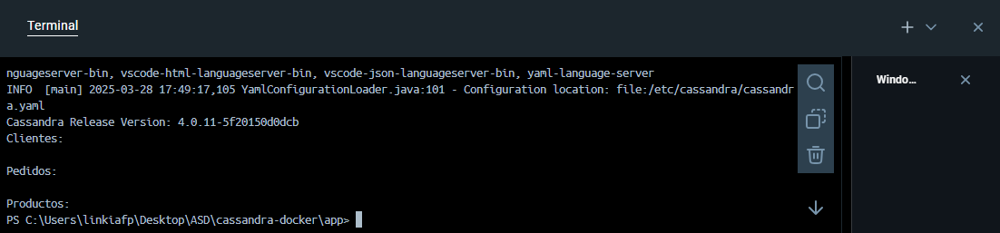

# cassandra-docker

# Conexión de Docker con Cassandra y Jupyter Notebook

Este repositorio contiene las instrucciones para configurar un contenedor Docker que ejecuta Cassandra junto con Jupyter Notebook.

## Instrucciones

1. Clona este repositorio o descarga los archivos.

2. Abre una terminal y navega a la carpeta donde se encuentran los archivos del proyecto:

   cd "ruta"

3. Construye la imagen Docker ejecutando el siguiente comando:

   docker build -t cassandra-jupyter .

4. Ejecuta el contenedor Docker con los siguientes parámetros:

   docker run --env-file .env -p 8888:8888 -p 9042:9042 --name cassandra-notebook cassandra-jupyter

   Este comando hace lo siguiente:
   - Carga las variables de entorno desde el archivo `.env`.
   - Expone el puerto 8888 para acceder a Jupyter Notebook.
   - Expone el puerto 9042 para conectarse a Cassandra.

5. Una vez que el contenedor esté en funcionamiento, podrás acceder a Jupyter Notebook a través de tu navegador en la dirección `http://localhost:8888`.

## Resultados

A continuación se muestran los resultados de la conexión entre Docker y Cassandra:

## Notas

- Asegúrate de tener Docker instalado y funcionando correctamente en tu máquina antes de proceder.
- Si encuentras algún problema con la conexión a Cassandra o Jupyter, revisa los logs del contenedor usando el siguiente comando:

   docker logs cassandra-notebook
